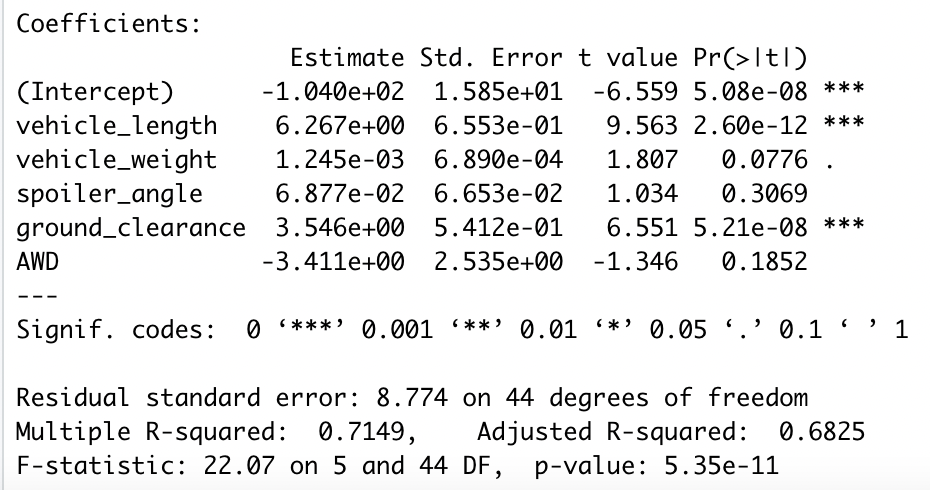
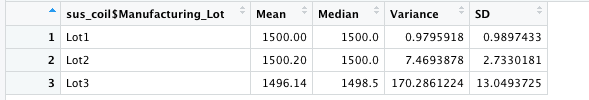

# MechaCar_Statistical_Analysis

## Linear Regression to Predict MPG 

 

After evaluating the summary results of a linear regression of the MechaCar data, it seems that Vehicle Length, Vehicle Weight, and Ground Clearance have a non-random amount of variance that correlates with the MPG of the car model. Because the r-squared value has increased to 0.715 compared to the usual 0.5 significiance, this model does fit well with predicting correlation from the provided data and means that the slope is more than 0. 

## Summary Statistics on Suspension Coils

 
